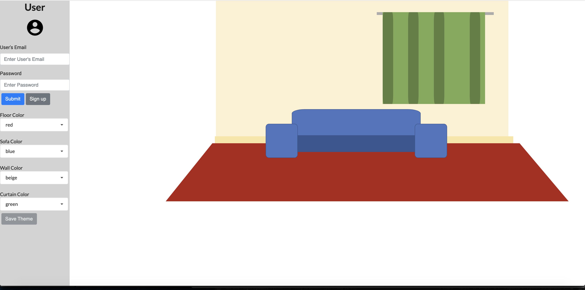

## AMEX Project

# Installation
1) git clone application
2) run both room-api and room-react with yarn start.  i.e.) cd into room-api and room-react and run "yarn".  Then, run "yarn start" for both room-api and room-react.
3) open http://localhost:3000/ 

